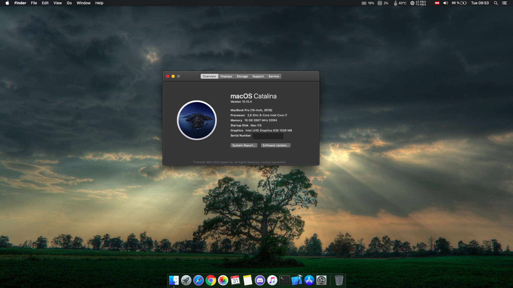
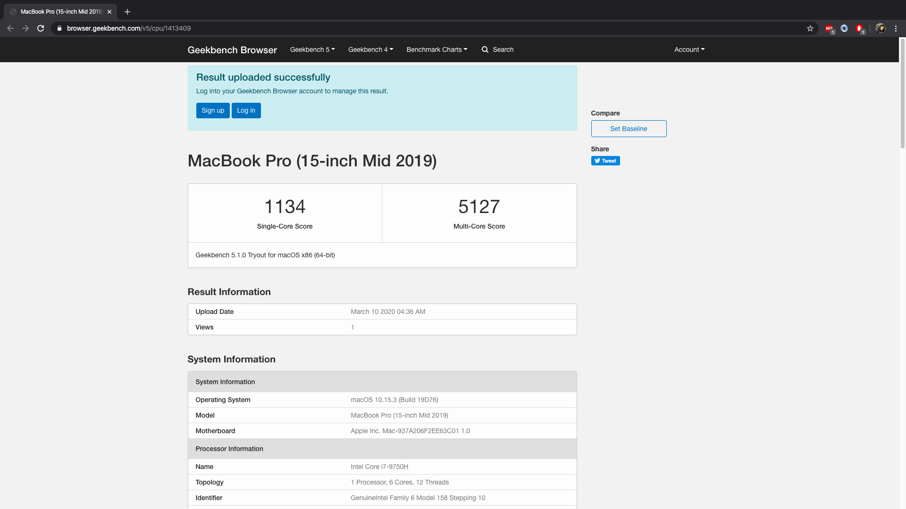
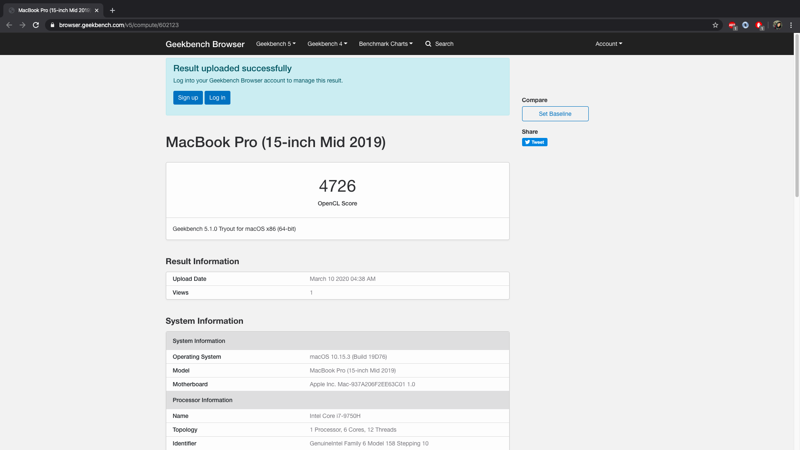

<!DOCTYPE html>
<html lang="en">
<head>
<meta charset="UTF-8">
<meta name="viewport" content="width=device-width, initial-scale=1.0">
<meta http-equiv="X-UA-Compatible" content="ie=edge">
</head>

<body>

<h2>Nitro-5-an517-51-Hackintosh</h2>

  

<strong>Images</strong>

 

 

 

 

  

<strong>What's working </strong>

 
<table border="1px">

<tr>
<td>

 WiFi + Bluetooth + Airdrop + Universal Clipboard + Handoff + Continuity Camera + iPhone Cellular Calls (DW1820a) 

</td>

</tr>

<tr>
<td>

Power Managment is very stable most of the time cpu Fan will not load but it depends on what you are doing 

</td>
</tr>

<tr>
<td>

TouchPad + all gestures Finally after month of researching 

</td>
</tr>

<tr>
<td>

 Fully Functional QE/CI Enabled Graphics 

</td>
</tr>

<tr>
<td>

 intel bluetooth and WiFi on AX200 card 

</td>
</tr>

<tr>
<td>

 Display brightness with hot keys 

</td>
</tr>

<tr>
<td>

 FaceTime, Messages, etc... 

</td>
</tr>

<tr>
<td>

 iGPU with disabled dGPU 

</td>
</tr>

<tr>
<td>

Audio & headphone jack 

</td>
</tr>

<tr>
<td>

Battery Management  

</td>
</tr>

<tr>
<td>

 All USB ports

</td>
</tr>

<tr>
<td>

WebCam  

</td>
</tr>

<tr>
<td>

 Ethernet 

</td>
</tr>

<tr>
<td>

Sidecar

</td>
</tr>

<tr>
<td>

 <a style="text-decoration:none" href="https://dortania.github.io/OpenCore-Post-Install/universal/sleep.html">Sleep (Preparations section)</a>

</td>
</tr>

</table>

<strong>Disabled Devices </strong>

 

GTX 1660Ti 

<strong>Bios Settings </strong>

 

<table border="1px">
<tr>
<td>

Main → click on (calt+s) a new setting will appear to change SATA type to AHCI otherwise you will not be able to see you drive when installing hackintosh 

</td>
</tr>

<tr>
<td>

Security → Set supervisor password (to disable secure boot)

</td>
</tr>

<tr>
<td>

Security → Password on boot → Disable

</td>
</tr>

<tr>
<td>

Boot → Secure Boot → Disable

</td>
</tr>

</table>

<strong>Not Working </strong>

 

HDMI (Nvidia Optimus is hardwire to HDMI)

<strong>Info</strong>

 

<table border="1px">
<tr>
<td>

When you switch SATA type to AHCI you might not be able to boot to windows again but do not worry here is a guide i found to switch without getting any issue <a href="https://support.thinkcritical.com/kb/articles/switch-windows-10-from-raid-ide-to-ahci">Here</a>

</td>
</tr>

<tr>
<td>

You need to disable SystemProfilerMemoryFixup.kext if you wanna enter recovery mode or you will get kernel panic

</td>
</tr>

<tr>
<td>

To get right click to work go to touchpad settings in (Secondary click) choose (click in bottom right corner)

</td>
</tr>

<tr>
<td>

If apple Continuity did not worked try logout and login again on all your devices your hackintosh too

</td>
</tr>

<tr>
<td>

OpenCore Guide <a href="https://dortania.github.io/OpenCore-Install-Guide/">Here</a>

</td>
</tr>

</table>

<strong>Updates</strong>

 

<table border="1px"> 
   
<tr>
<td>

 UPDATES 14.06.2020-OpenCore    Add itlwmx.kext to get Intel-AX200 wifi to work but it's still in beta it will take time to improve (AX200 will work as Ethernet) read here for more info <a href="https://github.com/zxystd/itlwm">Here</a>

</td>
</tr>

<tr>
<td>

 UPDATES 09.06.2020-OpenCore    Bluetooth has been fixed you need to pin-masking <a href="https://osxlatitude.com/forums/topic/11540-dw1820a-the-general-troubleshooting-thread/?do=findComment&comment=91179">Here</a>  

</td>
</tr>

<tr>
<td>

 UPDATES 26.05.2020-OpenCore    Add kext for intel Bluetooth for WiFi you can now search but still no internet so for now i will only add kext to get bluetooth to work intel-Bluetooth 

</td>
</tr>

<tr>
<td>

 UPDATES 23.05.2020-OpenCore    Remove igfxpavp=1 and igfxfw=2 boot arg to fix an issue where gpu usage will stay high after playing video on appstore  

</td>
</tr>

<tr>
<td>

 UPDATES 20.05.2020-OpenCore    Fix USB Power Managment SSDT-USBX

</td>
</tr>

<tr>
<td>

UPDATES 18.05.2020-OpenCore    OC-DW1820a   Kexts

</td>
</tr>

<tr>
<td>

 UPDATES 15.05.2020-OpenCore     OpenCore 0.5.8   Resources Folder   OC-Config.plist   Kexts 

</td>
</tr>

<tr>
<td>

 UPDATES 14.04.2020-OpenCore   Add SSDT-USBX.aml for USB-Power because after i tested usb-stick 3.1 gen i noticed it did not worked so now all port work normaly with super speed too   OC-Config.plist 

</td>
</tr>

<tr>
<td>

 UPDATES 12.04.2020-OpenCore    Fix an issue when usb is pluged-in the laptop will not sleep with SSDT-GPRW   Replace SSDT-NoHybGfx with SSDT-NDGP_OFF to make sleep faster   OC-Config.plist 

</td>
</tr>

<tr>
<td>

 UPDATES 11.04.2020-OpenCore    Replace DSDT with SSDT-BRKEY and SSDT-I2C-TPAD because placing DSDT will cause conflict with other patches    Add NVMeFix.kext to get better power managment for NVMe   OC-Config.plist  

</td>
</tr>

<tr>
<td>

 UPDATES 10.04.2020-OpenCore   Brightness with native hot keys   TouchPad has been fixed   OC-Config.plist   ACPI Patches 

</td>
</tr>

<tr>
<td>

 UPDATES 07.04.2020-OpenCore    better way to enable Apple ALC   CPUFriend-1.2.0-DevBuild    WhateverGreen-1.3.8   Resources Folder   VirtualSMC-1.1.2   AppleALC-1.4.8   OC-Config.plist   Lilu-1.4.3  

</td>
</tr>

</table>

</body>

</html> 

